## Capstone Project-Linux Shell Scripting

### Introduction:
The Linux Shell Scripting Capstone Project involves creating a Bash script that generates multiplication tables. By utilizing various loop structures, including list form and C-style for loops, this project develops and refines essential scripting skills.

**Objective**:
 Create a Bash script that generates a multiplication table for a number entered by the user. This project will help you practice using loops, handling user input, and applying conditional logic in Bash scripting.

 ### Tools Utilized
1. **GitHub:** For repository management and collaboration.

2. **Git:** For terminal commands.

3. **Visual Studio Code and Markdown:** For documentation.

 ### Project Requirements:
- User Input for Number: The script must first ask the user to input a number for which the multiplication table will be generated.
Choice of Table Range: Next, ask the user if they want a full multiplication table (1 to 10) or a partial table. If they choose partial, prompt them for the start and end of the range.
- Use of Loops: Implement the logic to generate the multiplication table using loops. You may use either the list form or C-style for loop based on what's appropriate.
- Conditional Logic: Use if-else statements to handle the logic based on the user's choices (full vs. partial table and valid range input).
- Input Validation: Ensure that the user enters valid numbers for the multiplication table and the specified range. Provide feedback for invalid inputs and default to a full table if the range is incorrect.
- Readable Output: Display the multiplication table in a clear and readable format, adhering to the user's choice of range.
- Comments and Code Quality: Your script should be well-commented, explaining the purpose of different sections and any important variables or logic used. Ensure the code is neatly formatted for easy readability.
- Bonus: Ask the user if they want to see the table in ascending or descending order, and implement this feature using if-else statements combined with your loop of choice.

**Example Script Flow**:
1.	Prompt the user to enter a number for the multiplication table.
2.	Ask if they want a full table or a partial table.
•	If partial, prompt for the start and end numbers of the range.
3.	Validate the range inputs and handle invalid or out-of-bound entries.
4.	Generate and display the multiplication table according to the specified range.
5.	Provide clear output formatting for ease of reading. Bonus
6.	Enhanced User Interaction: Incorporate additional checks or features, like repeating the program for another number without restarting the script.
7.	Creative Display Options: Offer different formatting styles for the table display and let the user choose.
8.	Ask the user if they want to see the table in ascending or descending order, and implement this feature using if-else statements combined with your loop of choice.

### Project Approach:
The project will be completed through a systematic, step-by-step approach to ensure a logical and efficient execution of the task.

#### Step 1: GitHub Setup.
a) Log into your GitHub account using your username and password.
In the top-right corner of the GitHub dashboard, click on the "+" button or repositories.

b) A new page will open up, select "New repository".

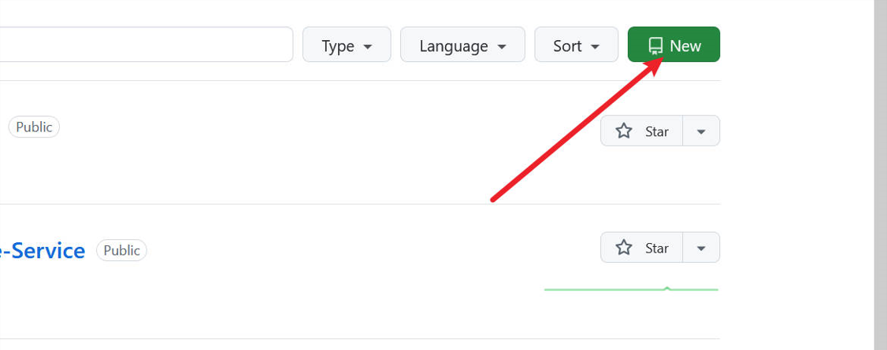

c) Fill in the required information:

- Repository name
- Description : Optional
- Select either public or private
README file: Optional
- Click "Create Repository.

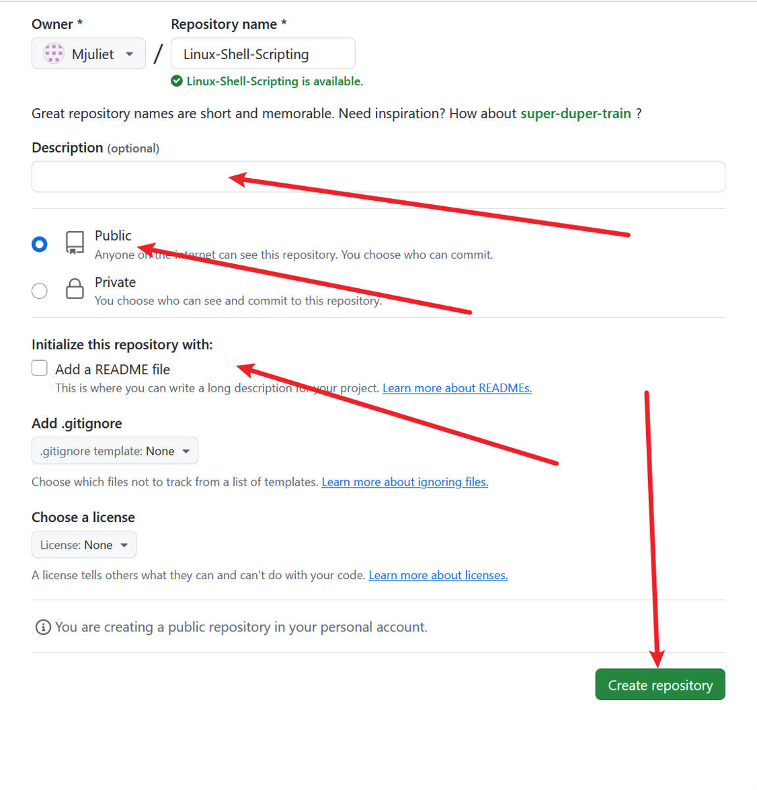

d) Navigate to your terminal and create a folder. 

e) cd into your folder.

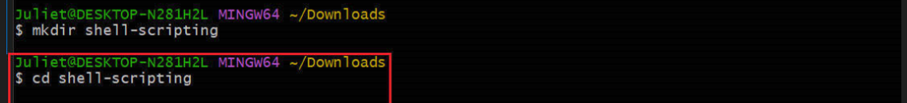

f) Navigate to VScode by typing code.

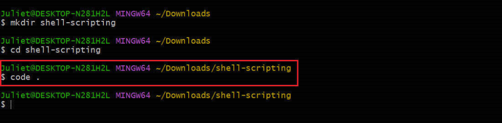

g) Once in your VScode, initialize your git.

#### Step 2: Bash Script Setup.

a) Create a file named multiplication_table.sh for the Bash scrip

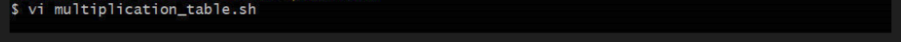

b) Change the file permissions to make the script executable.

#### Step 3. Push Updates to GitHub.

a) Commit and push the latest changes to the GitHub repository.

### Our Script
**Task:** Create a Bash script that generates a multiplication table for a number entered by the user using list form for loop and using C-style for loop.

#### 1. The list form: 
The list form will be used to generate the multiplication table and also illustrate a list based loop is straightforward and easy to understand.

#### 2. The C-style:
The C-style for loop will also be used to generate the multiplication table. This will illustrate a different loop syntax that is more flexible and closer to traditional programming language.

#### 3. Enter a number:
**Entry:**
The first step is asking the user to enter a number of the their choice for the multiplication number.
This will improve the script's flexibility and reusability.

**Result:**
When you run the script,this will be result.

#### 4. Full or Partial multiplication Table within a range:
a) The next step is to ask the user if they want a **full** or **partial** multiplication table (f for full, p for partial) within the range of 1-10

**Entry:**

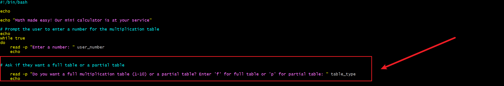

**Result:**

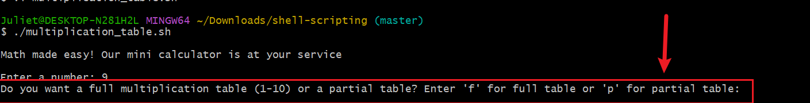

#### 5. Ascending or Descending:
Ask the user for the order of the table.(**a** for ascending or **d** for descending).

**Entry:**
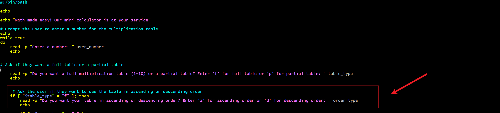

**Result:**

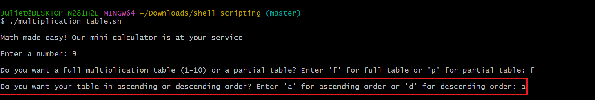

#### 6. Generate the multiplication table using both loop styles:

The next step is to generate the multiplication table using the list form and C-style for loops. This will illustrate the different looping styles.

**The list form**

**Entry:**

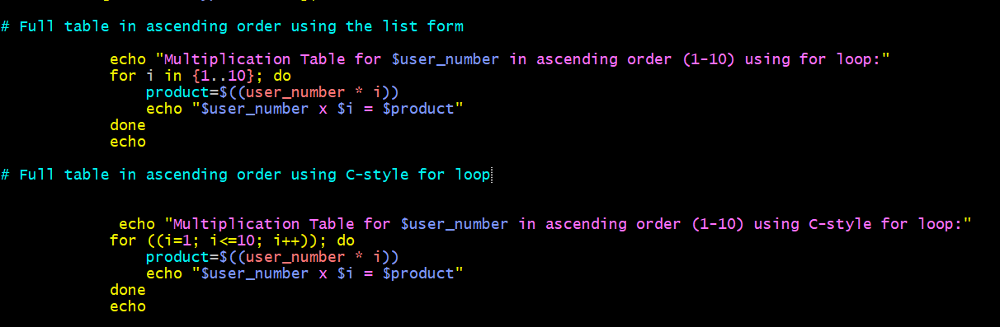

**Result:**

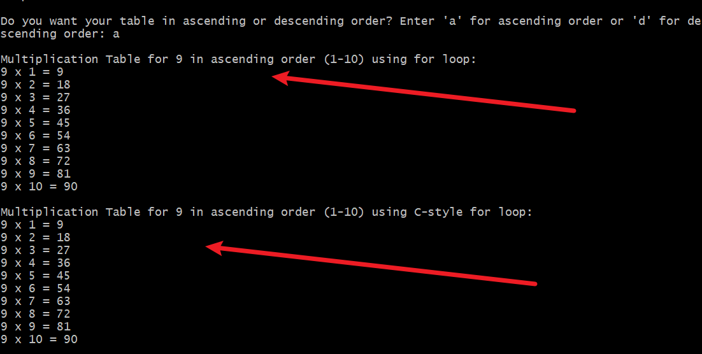

**The C-style for loops**

**Entry:**

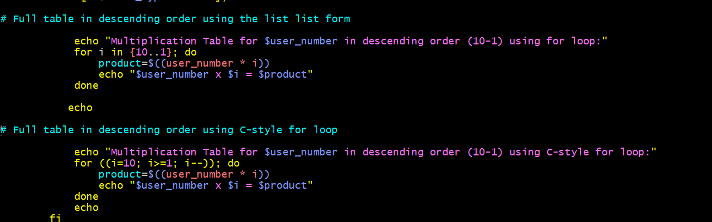

**Result:**

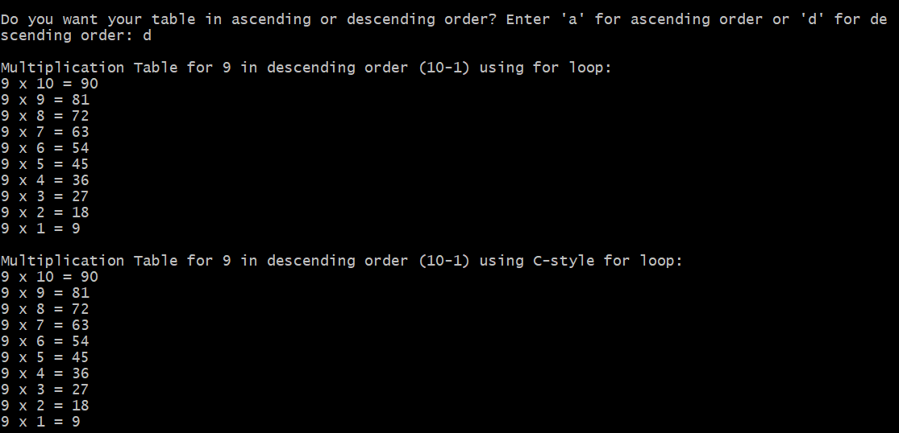

#### 7. Partial Table:
If it is partial table. Prompt the user to input the start and end numbers within the range range of 1-10.

**Entry:**

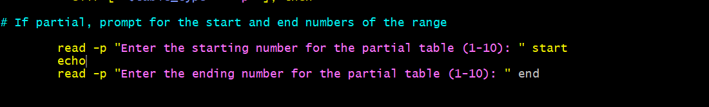

**Result:**

#### 8. Invalid input range:

We have to ensure that the user inputs a valid start and end numbers otherwise the script will generate a full table instead. This will provide clear feedback for invalid input.

**Entry:**

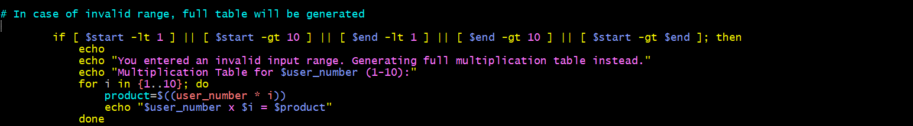

**Result:**

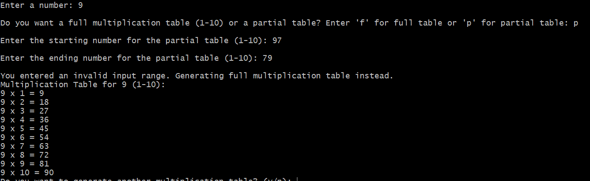

#### 9. Once you've verified the invalid input range, proceed to create a partial table using list form and C-style for loops, displaying both ascending and descending sequences.

**Acsending Entry:**

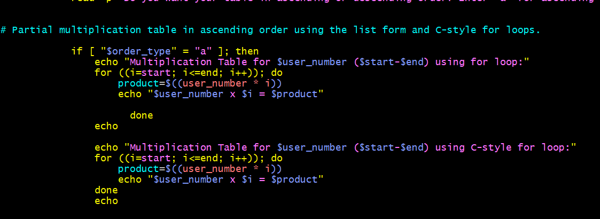

**Result:**

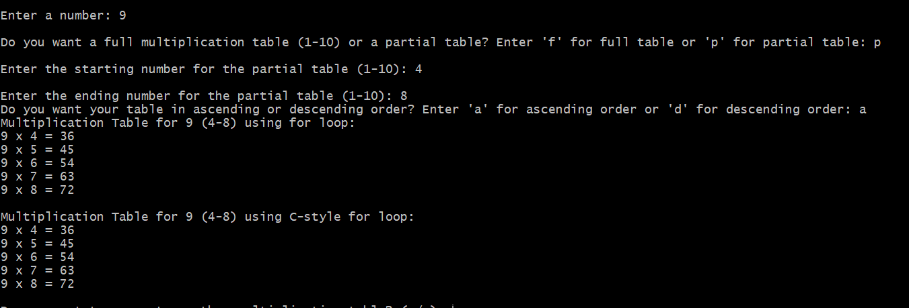

**Descending Entry**

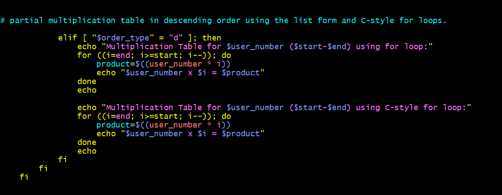

**Result:**

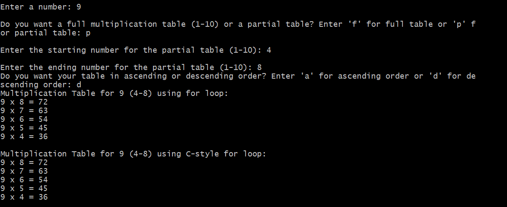

#### 10. Script Re-use Prompt: 
Lastly, we'll provide the user with the opportunity to generate another table, ensuring they can utilize the script multiple times if desired by asking them if they want to use the calculator again? (y/n).

**Entry:**

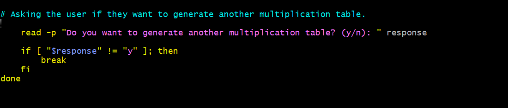

**Result:**

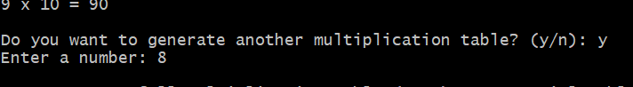

#### Conclusion:

This capstone project presents a comprehensive development of a flexible and intuitive Bash script, designed to generate multiplication tables in both list form and using C-style for loops. The project exemplifies collaborative development using GitHub and version control with Git.

## TROUBLESHOOTING

